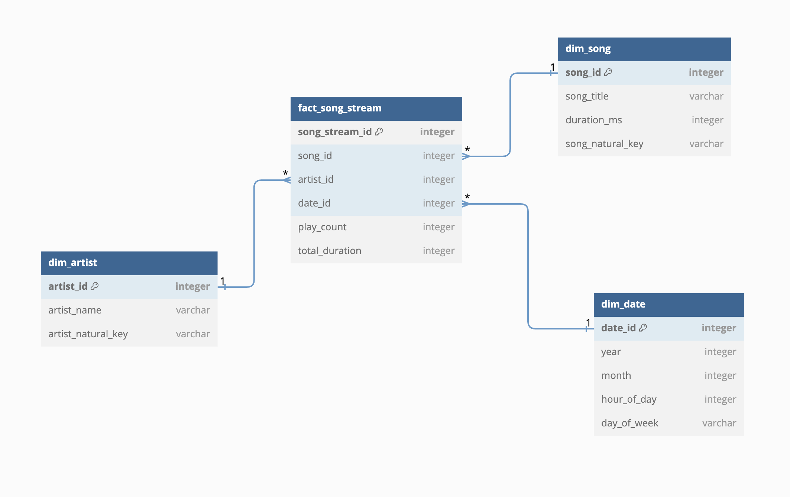

# Music Analytics Pipeline

A production-style ETL data pipeline that extracts personal Spotify listening data, transforms it using dbt, and visualizes insights in Metabase.


## Architecture


## Pipeline Overview

The pipeline runs daily via Apache Airflow and consists of the following tasks:

1. **authorize_user** — Fetches a fresh Spotify access token via OAuth refresh token flow
2. **create_star_schema_table** — Ensures the PostgreSQL star schema tables exist
3. **extract_spotify_recently_played** — Pulls the last 50 recently played tracks from the Spotify API
4. **save_to_staging_csv** — Saves raw data to a staging CSV layer
5. **transform** — Cleans and prepares data for loading
6. **save_df_to_processed_csv** — Saves processed data to CSV
7. **load** — Loads data into PostgreSQL star schema
8. **dbt_run** — Runs dbt models to build staging views and analytics mart tables
9. **dbt_test** — Runs 10 data quality tests across all models


## Data Model

Star schema with the following tables:

- `fact_song_stream` — play count and duration per song per date
- `dim_song` — song metadata
- `dim_artist` — artist metadata  
- `dim_date` — date/time dimensions



## dbt Models
models/
├── staging/
│   ├── stg_streams.sql
│   ├── stg_songs.sql
│   ├── stg_artists.sql
│   └── stg_dates.sql
└── marts/
├── mart_top_artists.sql
├── mart_top_songs.sql
└── mart_listening_patterns.sql
10 data quality tests including uniqueness and not-null checks on all key columns.

## Dashboard

Built with Metabase connected to PostgreSQL.


## Tech Stack

| Tool | Purpose |
|---|---|
| Spotify API | Data source |
| Apache Airflow | Orchestration |
| PostgreSQL | Data warehouse |
| dbt | Transformation & testing |
| Metabase | Dashboarding |
| Docker | Containerization |

## Setup

### Prerequisites
- Docker Desktop
- Spotify Developer account (Premium for recently-played endpoint)

### Steps

1. Clone the repo:
```bash
git clone https://github.com/Akshara26/music-analytics.git
cd music-analytics
```

2. Copy and fill in environment variables:
```bash
cp .env.example .env
```

3. Get a Spotify refresh token:
```bash
python3 get_token.py
```

4. Build and start:
```bash
docker compose up -d --build
```

5. Access services:

| Service | URL |
|---|---|
| Airflow | http://localhost:8080 |
| Metabase | http://localhost:3008 |
| PGAdmin | http://localhost:5050 |

6. Trigger the DAG in Airflow and watch it run end to end.

## Improvements Made Over Original

- Replaced fragile Selenium auth with proper OAuth refresh token flow
- Switched to `recently-played` endpoint with Premium account
- Added dbt transformation layer with staging and mart models
- Added 10 automated data quality tests
- Fixed hardcoded credentials from original author